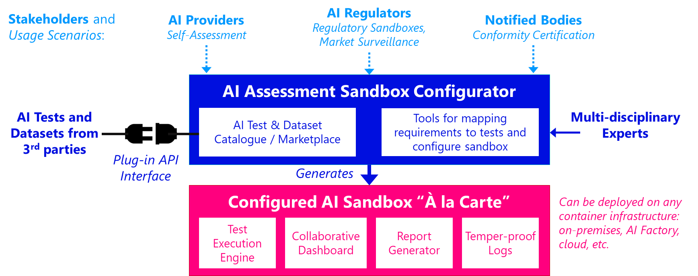

# AI Assessment Sandbox Configurator Request for Comments (RFC) 
> Towards an open and European "Hugging Face for AI Testing" - *March 2026*

---

## Overview

This repository hosts the RFC on the **AI Assessment Sandbox Configurator** — an open-source tool developed by the [Luxembourg Institute of Science and Technology (LIST)](https://www.list.lu) and the Interdisciplinary Centre for Security, Reliability and Trust (SnT), [University of Luxembourg](https://www.uni.lu) within the [Luxembourg AI Factory](https://aifactory.lu/) to scale the assessment of AI solutions across Europe.

We invite comments and contributions from the community.

---

## The Problem

As AI becomes increasingly powerful and pervasive, the number of AI systems requiring formal assessment is growing rapidly. The EU AI Act establishes clear obligations for AI providers to demonstrate trustworthiness, designating AI Regulatory Sandboxes as a key mechanism for structured dialogue between innovators and competent authorities (Art. 57 and 58).

However, setting up technical environments for AI assessment remains **highly complex and time-consuming**:

- Converting requirements into metrics
- Identifying relevant tests from disparate sources
- Integrating tests into a coherent testing environment
- Collecting and visualising results
- Generating reports and maintaining audit trails

These are largely manual processes — creating a significant barrier to adoption at scale.

---

## The Solution

The **AI Assessment Sandbox Configurator** is an open architecture that streamlines the configuration and deployment of tailored AI assessment environments *à la carte*.

Incubated within the **Luxembourg AI Factory**, it supports three stakeholder scenarios:

| Stakeholder | Use Case |
|---|---|
| AI Providers | Technical self-assessment |
| AI Competent Authorities | Operating AI Regulatory Sandboxes and market surveillance |
| Notified Bodies | Conformity certification |

### Key Capabilities

- **Requirement mapping** — guides users from regulatory requirements to assessment metrics
- **Curated test catalogue** — extensible catalogue of AI tests and datasets via an open plug-in API
- **Collaborative dashboard** — execute tests and visualise results
- **Structured reporting** — generates assessment reports with full audit trails
- **Infrastructure-agnostic** — deploy on-premises, AI Factories, or cloud with no vendor lock-in

---

## Vision

We envision the Sandbox Configurator becoming a **European sovereign open-source asset**, co-developed by a broad community of stakeholders — a *"Hugging Face for AI Testing"*.

### Strategic Benefits

**Scalability** — Significantly reduces the time and effort to configure a tailored AI Assessment Sandbox, enabling trustworthiness testing at scale across self-assessment, conformity certification, regulatory sandboxes, and market surveillance.

**Curated AI Testing Catalogue** — A structured, extensible catalogue integrating AI testing tools, controls, and datasets through an open plug-in API — with the potential to evolve into domain-specific marketplaces (e.g. healthcare, manufacturing, finance).

**Common Language** — A shared framework enabling multi-disciplinary collaboration and cross-domain comparability and reproducibility of assessment results.

**Regulatory Learning** — Machine-readable AI system cards and assessment exit reports that feed regulatory intelligence at organisational, national, and European levels.

---

## Documentation

| Document | Description |
|---|---|
| [Concept and Architecture](https://github.com/lux-ai-factory/rfc/blob/main/Concept%and%20Architecture.pdf) |  Overview document describing the context, the definitions, the requirements, the user journey and the open architecture of the Sandbox Configurator. The more technical parts are shaded in grey and can be skipped by non-technical readers. |
| [Catalogue of AI Tests and Controls.pdf](https://github.com/lux-ai-factory/rfc/blob/main/Catalogue%20of%20AI%20Tests%20and%20Controls.pdf) | Draft metadata schema for filtering and searching AI tests and controls in the Catalogue |
| [Plug-in API to integrate third-party tests into the Catalogue](https://github.com/lux-ai-factory/rfc/blob/main/Plugin%20Developer%20Guide.pdf) | Technical specifications for developers integrating third-party tests into the Catalogue via the plug-in API |

---

## How to Contribute

Please send you comments via the following web form: https://tally.so/r/WOPJ0J. For any questions, please contact: alessio.buscemi@list.lu and daniele.pagani@list.lu.

Thank you in advance for your interest and feedback!
-- The Luxembourg AI Factory Sandbox Team

## Contributors

| Name | Affiliation |
|---|---|
| Alessio Buscemi | LIST |
| Daniele Pagani | LIST |
| Maxime Cordy | SnT (University of Luxembourg) |
| Jordi Cabot Sagrera| LIST, SnT (University of Luxembourg) |
| Olivier Veneri | SnT (University of Luxembourg) |
| Prasad Adhav | LIST |
| Yu-Lin Huang | SnT (University of Luxembourg) |
| Tom Deckenbrunnen | LIST |
|Sean Blevins |  SnT (University of Luxembourg) |
| Méril Miangouila | LIST |
| Mohammed Fellaji | SnT (University of Luxembourg) |
| Idoia Landa Oregi | LIST |
| Carlo Iannaccone | SnT (University of Luxembourg) |
| Ivan David Alfonso Diaz | LIST |
| Suraj Maurya | LIST |

